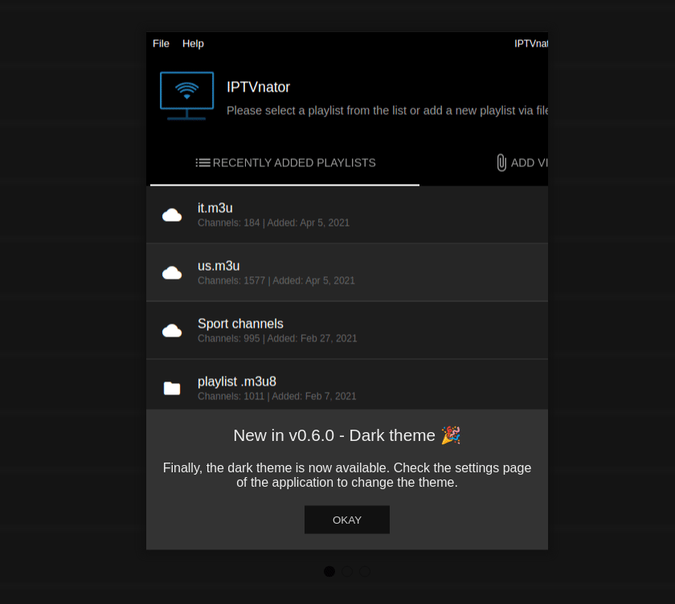

# NgxWhatsNew

Ngx-whats-new is an angular module with a multi-modal component that is typically used to present new features of your application.



```
    npm i ngx-whats-new
```

## Usage example:

[Codesandbox example](https://codesandbox.io/s/ngx-whats-new-demo-nxc8b?file=/src/main.ts)

Import the component:

```typescript
import { NgModule } from "@angular/core";
import { NgxWhatsNewComponent } from "ngx-whats-new";
import { AppComponent } from "./app.component";

@NgModule({
  declarations: [AppComponent],
  imports: [NgxWhatsNewComponent],
  bootstrap: [AppComponent],
})
export class AppModule {}
```

Use `<ngx-whats-new>` in your component:

app.component.html

```html
<button (click)="openDialog()">Open Dialog</button>

<ngx-whats-new
  #whatsNew
  (opened)="onOpen()"
  (closed)="onClose()"
  (navigation)="onNavigation($event)"
  [items]="modals"
  [options]="options"
/>
```

app.component.ts

```typescript
    @ViewChild('whatsNew') private readonly modal?: NgxWhatsNewComponent;

    /** Options for the modal */
    public options: DialogOptions = {
      enableKeyboardNavigation: true,
      clickableNavigationDots: true,
      disableClose: false,
      customStyle: {
        width: '500px',
        backgroundColor: '#fff',
        borderSize: '1px',
        textColor: '#222',
        borderRadius: '10px',
        boxShadow: '0px 0px 10px 5px #999',
      },
    };

    /** definition of all modals to show */
    modals = [
      {
        title: 'Whats new in v1.0.0',
        html: 'Lorem ipsum dolor sit amet, consectetur adipiscing el aspect et just.<br /><a href="http://google.com">test</a> ',
        image: {
          height: 500,
          src: 'https://picsum.photos/500',
          altText:
            'In v1.0.0, lorem ipsum dolor sit amet.',
        },
        button: {
          text: 'Okay',
          textColor: '#fff',
          bgColor: '#333',
          position: 'center',
        },
      },
      ...
    ];

    public openDialog(): void {
      this.modal?.open();
    }

    public onOpen(): void {
      console.log('Dialog opened');
    }

    public onClose(): void {
      console.log('Dialog closed');
    }

    public onNavigation($event: NavigationEvent) {
      console.info('Previous item:', $event.previousItem);
      console.info('Current item:', $event.currentItem);
    }
```

> [!NOTE]
> Optionally, you could use `@if` to conditionally render the component. Like so:
>
> app.component.html
>
> ```html
> @if (isDialogVisible) {
>   <ngx-whats-new
>     #whatsNew
>     (opened)="onOpen()"
>     (closed)="onClose()"
>     (navigation)="onNavigation($event)"
>     [items]="modals"
>     [options]="options"
>   />
> }
> ```
>
> app.component.ts
>
> ```typescript
>   public isDialogVisible: boolean | undefined;
>
>   public openDialog(): void {
>     isDialogVisible = true;
>   }
>
>   public onClose(): void {
>     isDialogVisible = false;
>   }
> ```

## Available Options:

General options:

```typescript
interface DialogOptions {
  disableClose?: boolean;
  enableKeyboardNavigation?: boolean;
  clickableNavigationDots?: boolean;
  customStyle: {
    width?: string;
    boxShadow?: string;
    backgroundColor?: string;
    textColor?: string;
    borderRadius?: string;
    borderSize?: string;
  };
}
```

Options of a single modal window:

```typescript
interface WhatsNewItem {
  title?: string;
  text?: string;
  html?: string;
  image?: {
    src: string;
    height?: number;
    bgColor?: string;
    altText: string;
  };
  button?: {
    text: string;
    textColor: string;
    bgColor: string;
    position?: "left" | "center" | "right";
  };
}
```
